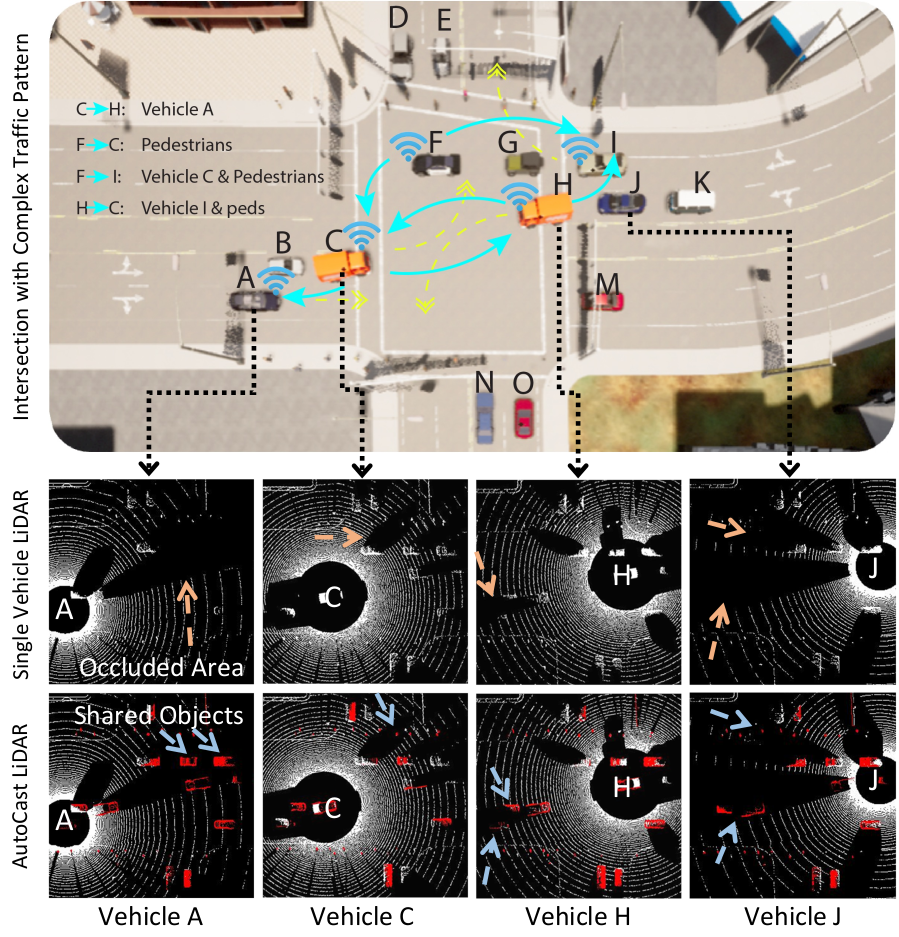

# AutoCast


AutoCast is an end-to-end autonomous system that enables scalable 
infrastructure-less cooperative
perception using direct vehicle-to-vehicle (V2V) communication. 
Using limited V2V bandwidth, **AutoCast** can easily eliminate safety hazards 
by coordinating **auto**nomous vehicles 
to **cast** objects in the occluded/invisible area to their peer receipients' perspective.
It carefully determines which 
objects to share based on positional relationships between traffic participants, 
and the time evolution of their trajectories. It coordinates vehicles and
optimally schedules transmissions in a scalable and distributed fashion. 



> [**AutoCast: Scalable Infrastructure-less Cooperative Perception for Distributed Collaborative Driving**](https://hangqiu.github.io/AutoCast/)    
> Hang Qiu, Po-Han Huang, Namo Asavisanu, Xiaochen Liu, Konstantinos Psounis, Ramesh Govindan\
> _ACM Mobisys 2022_

[Paper](https://arxiv.org/abs/2112.14947) | [Website](https://hangqiu.github.io/AutoCast/) | [Demo](https://youtu.be/uBmdCRmZNIo) | [Bibtex](#Citation) 

[](https://doi.org/10.5281/zenodo.6502335)


## Getting Started
### Prerequisites
Ubuntu 20.04, Cuda 11.0, PyTorch == 1.7.1, PyTorch Geometrics, [Carla 0.9.11](https://carla.readthedocs.io/en/0.9.11/start_quickstart/),
[Minkowski Engine](https://github.com/NVIDIA/MinkowskiEngine) (CPU version is sufficient)

### Installation
Clone the AutoCast repo with AutoCastSim submodule.

```bash
git clone --recursive git@github.com:hangqiu/AutoCast.git
git submodule update --remote
```

Installing dependencies and config paths
```bash
apt-get install mosquitto libopenblas-dev
apt remove python3-networkx
pip3 install -r requirements.txt
export SIM_ROOT=${PWD}/AutoCastSim
export SCENARIO_RUNNER_ROOT=${PWD}/AutoCastSim/srunner
export PYTHONPATH=${PYTHONPATH}:${SCENARIO_RUNNER_ROOT}:${SIM_ROOT}
```

## Running Demo Scenarios

Overtaking|Unprotected Left-turn|Red-light Violation|
---|---|---
 |  |  
 | | 

Run Carla
```shell
bash run_carla.sh [GPU_ID] [CARLA_PORT]
```

In a different terminal, run test scenarios, and follow the prompt to select scenario ID (Overtake(6), Left-turn(8), Red-light(10), Static(test))
```shell
bash run_test.sh [CARLA_PORT]
```


## Running with Specific Configuration
The specific scripts to run each scenario is stored in run_test.sh. For example, to run the red-light violation scenario:
```shell
python3 scenario_runner.py \
  --route srunner/data/routes_training_town03_autocast10.xml \
  srunner/data/towns03_traffic_scenarios_autocast10.json   \
  --reloadWorld \
  --bgtraffic 0 \
  --agent AVR/autocast_agents/simple_agent.py \
  [--hud --sharing]
```
The scenarios are configured using flags. E.g. to enable sharing mode, add *--sharing*; to increase the traffic density (simulation does get slower!), 
change the *--bgtraffic* variable from 0 to 30.

For more detailed scenario configuration, please see [config.md](docs/Config.md) and instructions [here](https://github.com/hangqiu/AutoCastSim#running-demo-scenarios)

## Running with Real Radios
We provide scripts to run with special hardware (e.g iSmartways V2V radios). If you are interested and have a similar setup, please contact us for a custom setup. 

## Training Your Cooperative Driving Agent
Please refer to [Coopernaut](https://github.com/UT-Austin-RPL/Coopernaut) as an example agent trained using AutoCast.
We provide a [training dataset](https://utexas.box.com/v/coopernaut-dataset) for behavior cloning based on a simple rule-based agent. 
You can also collect your own data and train your own agents following these [instructions](https://github.com/UT-Austin-RPL/Coopernaut).


## Citation

```bibtex
@inproceedings{autocast,
  title={AutoCast: Scalable Infrastructure-less Cooperative Perception for Distributed Collaborative Driving},
  author={Hang Qiu and Pohan Huang and Namo Asavisanu and Xiaochen Liu and Konstantinos Psounis and Ramesh Govindan},
  booktitle = {Proceedings of the 20th Annual International Conference on Mobile Systems, Applications, and Services},
  series = {MobiSys '22},
  year={2022},
}

```
