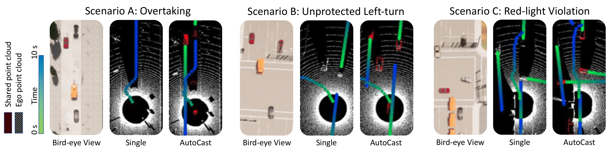

<link href='https://fonts.googleapis.com/css?family=Titillium+Web:400,600,400italic,600italic,300,300italic' rel='stylesheet' type='text/css'>
<head><meta http-equiv="Content-Type" content="text/html; charset=UTF-8">
  <title>AutoCast: Scalable Infrastructure-less Cooperative Perception for Distributed Collaborative Driving</title>

<!-- <meta property="og:image" content="images/teaser_fb.jpg"> -->
<meta property="og:title" content="TITLE">

<!-- Global site tag (gtag.js) - Google Analytics -->

<link media="all" href="./css/glab.css" type="text/css" rel="StyleSheet">

<link media="all" href="./css/slideshow.css" type="text/css" rel="StyleSheet">

<meta content="MSHTML 6.00.2800.1400" name="GENERATOR"></head>

<body data-gr-c-s-loaded="true">

<h1><strong>AutoCast: Scalable Infrastructure-less Cooperative Perception for Distributed Collaborative Driving</strong></h1>

<h2> 
    <a href="https://web.stanford.edu/~hangqiu/">Hang Qiu</a>&nbsp;&nbsp;&nbsp;
    <a href="https://www.linkedin.com/in/po-han-huang-0713/">Pohan Huang</a>&nbsp;&nbsp;&nbsp;
    <a href="">Namo Asavisanu</a>&nbsp;&nbsp;&nbsp;
    <a href="https://nsl.usc.edu/people/xiaochen-liu/">Xiaochen Liu</a> &nbsp;&nbsp;&nbsp;
    <a href="https://sites.usc.edu/kpsounis/">Konstantinos Psounis</a>&nbsp;&nbsp;&nbsp;
    <a href="https://govindan.usc.edu/">Ramesh Govindan</a>&nbsp;&nbsp;&nbsp; 
   </h2>

<h2>
        <a href="https://www.usc.edu/">University of Southern California</a>&nbsp;&nbsp;&nbsp; 
</h2>

ACM Mobisys 2022

<h2><a href="https://arxiv.org/abs/2112.14947">Paper</a> | <a href="https://github.com/hangqiu/AutoCast">Code</a> | <a href="https://youtu.be/uBmdCRmZNIo">Demo</a> | <a href="#bibtex">Bibtex</a> </h2>

<table border="0" cellspacing="10" cellpadding="0" align="center"> 
<tbody><tr><td><left>
AutoCast is an end-to-end autonomous system that enables scalable infrastructure-less cooperative perception using direct vehicle-to-vehicle (V2V) communication. Using limited V2V bandwidth, AutoCast can easily eliminate safety hazards by coordinating autonomous vehicles to cast objects in the occluded/invisible area to their peer receipients' perspective. It carefully determines which objects to share based on positional relationships between traffic participants, and the time evolution of their trajectories. It coordinates vehicles and optimally schedules transmissions in a scalable and distributed fashion.
</left></td></tr></tbody></table>

<table border="0" cellspacing="10" cellpadding="0" align="center">
  <tbody><tr><td align="center">

</td></tr>
</tbody>
</table>

<h1 align="center">AutoCast Overview</h1>
<table border="0" cellspacing="10" cellpadding="0" align="center"> 
<tbody>
<tr><td><left>
AutoCast’s end-to-end architecture contains a control-plane that exchanges beacons and makes transmission scheduling decisions, and a data-plane that processes, transmits, and uses point clouds to make trajectory planning decisions. This decoupling of data and control ensures that bandwidth intensive point cloud data is directly transmitted between vehicles with minimum delay for real time decisions, while at the same time the control plane is able to make near optimal scheduling decisions. 
</left>
</td></tr>
<tr><td>
<video muted autoplay loop width="1000" controls>
  <source src="./media/AutoCastOverview.mp4" type="video/mp4">
</video>
</td></tr>
</tbody>
</table>

<h1 align="center">Evaluation Scenarios</h1>
<table border="0" cellspacing="10" cellpadding="0" align="center">
<tbody>
<tr>
<td align="center">

</td>
</tr>
</tbody>
</table>

<table border="0" cellspacing="10" cellpadding="0" align="center"> 
<tbody><tr><td><left>
End-to-end evaluation scenarios: overtaking, unprotected left-turn, and red-light violation. 
A planner on the ego vehicle (gray, bottom of the bird-eye view) finds a trajectory to navigate through each scenario without collision. 
The gradient trajectory color (green to blue) indicates a temporal horizon (closer to farther). 
The LiDAR views show the perception results using either non-sharing baseline (Single) or AutoCast. 
The red points in the LiDAR view are shared points, while the white ones are from the ego vehicle itself. 
In each scenario, a passive (without  communication capability)  collider vehicle (red), 
occluded by a truck (orange) and thus invisible from the ego's Single view,  
may cause a hazardous situation. AutoCast makes the ego vehicle aware of the collider so the ego can react early to avoid a collision.
</left>
</td></tr></tbody>
</table>

<h1 align="center">Qualitative Results</h1>
<table border="0" cellspacing="10" cellpadding="0" align="center"> 
<tbody><tr><td><left>
Here we provide qualitative side-to-side comparisons using a simple planner leveraging A* search, given single-vehicle-based perception versus cooperative perception from AutoCast. Please click on the thumbnails to switch to a specific scenario.
</left></td></tr></tbody>
</table>

<table border="0" cellspacing="10" cellpadding="0" align="center"> 
<tbody><tr><td>
<!-- Container for the image gallery -->

  <!-- Thumbnail images -->
  

    

      Scenario 6: Overtaking.</b>
      The controlled ego car will make a lane-change maneuver at the two-way yellow-dashed road when a truck is stuck in front of it. Our model avoids collisions by acting less aggressively and appropriately yielding to the opposite-going vehicles.">
    

    
    

      Scenario 8: Left Turn.</b>
      The red car is going straight in the opposite direction, occluded behind the orange truck. Our model avoids the collisions by properly yielding to the red car before left-turning, even with the partially observable situation.">
    

    
    

      Scenario 10: Red Light Violation.</b>
      The controlled vehicle is going straight to pass an intersection on green lights. Coopernaut identifies the abnormal behaviors of the collider(red car) and proactively hard brakes to avoid the potential collision.">
    

  

  <!-- Full-width images with number text -->
  

    
1 / 3

    <video muted autoplay loop width="1020" controls>
    <source src="./src/qualitative6-v9.mp4" type="video/mp4">
    </video>
  

  

    
2 / 3

    <video muted autoplay loop width="1020" controls>
    <source src="./src/qualitative8-v9.mp4" type="video/mp4">
    </video>
  

  

    
3 / 3

    <video muted autoplay loop width="1020" controls>
    <source src="./src/qualitative10-v9.mp4" type="video/mp4">
    </video>
  

  <!-- Next and previous buttons -->
  <a class="prev" onclick="plusSlides(-1)">&#10094;</a>
  <a class="next" onclick="plusSlides(1)">&#10095;</a>

  <!-- Image text -->
  

    

  

</td></tr></tbody>
</table>

<h1 id="bibtex" align="center">Citation</h1>
<table border="0" cellspacing="10" cellpadding="0" align="center"> 
<tr><td><left>
<pre><code style="display:block; width:1000px; overflow-x: auto">@inproceedings{autocast,
  title={AutoCast: Scalable Infrastructure-less Cooperative Perception for Distributed Collaborative Driving},
  author={Hang Qiu and Pohan Huang and Namo Asavisanu and Xiaochen Liu and Konstantinos Psounis and Ramesh Govindan},
  booktitle = {Proceedings of the 20th Annual International Conference on Mobile Systems, Applications, and Services},
  series = {MobiSys '22},
  year={2022},
}
</code></pre>
</left></td></tr></table>

<!--
 

<table align=center width=1000px>

<tr><td><left>

<h1>Acknowledgements</h1>

We would like to thank

</left></td></tr></table>

  
-->

<!-- GoStats JavaScript Based Code -->

<noscript></noscript>

<!-- End GoStats JavaScript Based Code -->
<!-- 

</body>
 -->

